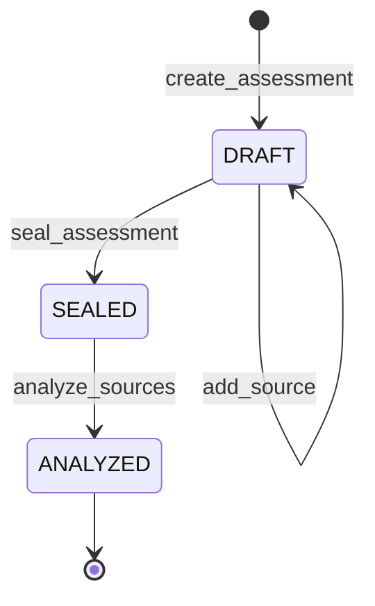

# Architecture

EchoTrace is one Intelligent Contract. It stores assessments, their sealed sources, and a consensus provenance graph. It does not store pages or model transcripts.

## Lifecycle



| Transition | Caller | Preconditions | Failure codes |
| --- | --- | --- | --- |
| `create_assessment` | any account, becomes creator | title 1–120, context 0–400, no control characters | `title required`, `title too long`, `context too long` |
| `add_source` | creator | status `DRAFT`, fewer than 6 sources, new canonical URL | `not creator`, `not draft`, `too many sources`, `duplicate url`, URL errors below |
| `seal_assessment` | creator | status `DRAFT`, at least 2 sources | `not creator`, `not draft`, `too few sources` |
| `analyze_sources` | any account | status `SEALED`, `has_analysis` false | `not sealed`, `already analyzed`, `malformed llm output` |

There is no cancel, reopen, or re-analyze transition. A failed analyze transaction reverts, so the assessment remains `SEALED` and can be retried until one analyze commits.

Assessment ids are `u32` values `0 .. assessment_count-1`. `create_assessment` returns the new id and increments `assessment_count`; it fails at the `u32` count limit before that value could wrap and collide. Source ids inside an assessment are `0 .. source_count-1` in insertion order and never move.

## Persistent records

```text
Assessment
  creator: Address
  title, context: str
  status: u8                         0 DRAFT, 1 SEALED, 2 ANALYZED
  source_count: u8
  analysis_revision: u32             0 until the successful analyze, then 1
  has_analysis: bool
  confirmed_group_count: u8
  unresolved_source_count: u8
  unresolved_relation_count: u8
  ambiguous: bool

Source
  url: str                           caller string, after strip, not rewritten
  label: str                         not sent to the model
  canonical_url: str                 duplicate key
  retrieval_status: u8               0 UNSET, 1 OK, 2 FAILED
  group_id: u8                       255 means unassigned

Relation
  relation: u8                       0..5, see README
  reason: str                        canonical reason code, consensus-critical
```

`TreeMap` keys:

- assessments: the `u32` id
- sources: `"{assessment_id}:{source_id}"`
- relations: `"{assessment_id}:{a}:{b}"` with `a < b`

Python `list` and `dict` are not stored. Dataclasses are marked `@allow_storage` (`allow` imported under that name on the preview runner). Integers that live in storage are `u8` or `u32`.

`context` documents the collection for humans. It is not an input to classification. Putting a claim in `context` does not make EchoTrace vote on that claim.

## URL identity

`add_source` keeps the stripped original string and also a canonical key:

- scheme must be `https`
- userinfo and `@` in the authority are rejected
- fragments are rejected
- `<>`, backslash, and characters below ASCII 32 are rejected
- host is IDNA-encoded, lowercased, and trailing dots are removed
- default port 443 is omitted; any other port is kept
- path `/` stays; one trailing slash on a longer path is removed
- query is kept

Two URLs that canonicalize to the same key cannot be added to the same assessment (`duplicate url`). The fetch uses the stored original URL, which has already passed the same parser.

## What analysis writes

`analyze_sources` copies every `Source` with `gl.storage.copy_to_memory` and reads `url` in deterministic code, before `leader_fn` is defined. The nondeterministic block returns one decision object. After it returns, `_persist_analysis` checks the object against the sealed source count. Only then does it write:

1. every canonical relation
2. retrieval status and group id on each source
3. the assessment row, with `status = ANALYZED` and `has_analysis = true` last

Validation failures raise before those writes. If a write inside the call fails, GenVM reverts the transaction, so a half-written matrix is not observable after the call.

No method deletes or overwrites a relation except this one-shot persist. There is no admin setter.

## How groups are derived

Groups are not a second model call. They are a union-find over the grounded relation codes.

1. Start with each source as its own parent.
2. Union pairs whose retrieval is `OK`/`OK` and whose code is one of `A_DERIVES_FROM_B`, `B_DERIVES_FROM_A`, `COMMON_ORIGIN`, `SYNDICATED`.
3. A `UNKNOWN` pair between two `OK` sources marks both components invalid and sets `ambiguous`.
4. An `INDEPENDENT` pair whose endpoints already sit in the same component is a contradiction. That component is invalid and `ambiguous` is set.
5. `UNKNOWN` because a fetch failed increments `unresolved_relation_count` but does not invalidate the other endpoint.
6. Failed sources are not members of any confirmed group. Their `group_id` stays `255`.
7. Remaining components are numbered `0..k-1` by ascending smallest source id. Those are the confirmed provenance groups.

A confirmed group of size 1 is a source that was affirmatively `INDEPENDENT` of the sources it was compared with, or a single `OK` source whose other comparisons did not pull it into a related or invalid component. It is not "we failed to find a copy."

`get_provenance_groups` returns only confirmed groups. `get_provenance_group` on a missing or unassigned id raises `group not found`. `get_analysis_summary` lists `unassigned_source_ids` separately from `confirmed_group_count`.

Worked shapes:

| Pairwise result | Groups |
| --- | --- |
| A and B both `OK`, relation `UNKNOWN` | no confirmed groups, both unassigned, `ambiguous` |
| A and B `INDEPENDENT` | two confirmed groups, `{A}` and `{B}` |
| A derives from B, both `OK` | one confirmed group `{A,B}` |
| A syndicates B, C is `INDEPENDENT` of both, all `OK` | `{A,B}` and `{C}` |
| A syndicates B, and A is `UNKNOWN` against C | the related component and C are unassigned, `ambiguous` |
| A is `OK`, B failed | pair `UNKNOWN` / `unfetched`, A may still be grouped with other `OK` sources, B stays 255 |

## Reads

Views return Studio-friendly structures: strings, ints, bools, and lists of dicts. `get_relation(assessment, a, b)` loads the canonical edge and, if the caller passed `a > b`, swaps `A_DERIVES_FROM_B` with `B_DERIVES_FROM_A` and the matching reason codes. Symmetric relations are not rewritten.

`get_relations` always emits canonical order. For `n` sources the length is `n*(n-1)/2`. An analyzed assessment always has that complete set; missing edges are a persist bug, and `relation not found` exists so a corrupt or pre-analysis read fails explicitly.

`map_evidence_flags` exposes the priority table without retrieval:

1. evidence not `sufficient`, or no positive flag → `UNKNOWN`
2. independence together with any dependence flag → `UNKNOWN`
3. both directions of derivation, plus syndication → `SYNDICATED`
4. both directions, plus a shared upstream and no syndication → `COMMON_ORIGIN`
5. both directions otherwise → `UNKNOWN`
6. syndication → `SYNDICATED`
7. A depends on B → `A_DERIVES_FROM_B`
8. B depends on A → `B_DERIVES_FROM_A`
9. shared upstream → `COMMON_ORIGIN`
10. independent primary → `INDEPENDENT`
11. otherwise → `UNKNOWN`

Analysis does not trust step 1's model bit. `_ground` overwrites `evidence` from whatever flags survive quote checks.

## Bounds

Consensus cost is bounded on purpose.

| Limit | Value |
| --- | --- |
| sources per assessment | 2–6 |
| URL | 512 |
| title | 120 |
| context | 400 |
| label | 80 |
| raw body considered | 60,000 characters |
| normalized text | 5,000 characters |
| quote/upstream evidence string | 4,000 characters |
| stored reason | 64 characters |
| quote minimum | 12 characters |
| upstream name minimum | 6 characters |
| host stem minimum | 4 characters |
| pairwise Jaccard threshold | 45%: independent pairs must be below it; syndication requires at least this overlap |
| model output string | 200,000 characters |
| each model evidence string | 4,000 characters |

Six sources produce 15 pairs and at most one model call per analyze, because every `OK`/`OK` pair is packed into a single JSON prompt. Failed pairs are omitted from that prompt. The runtime has already retrieved the response body before EchoTrace considers the first 60,000 characters; the contract does not set an HTTP byte limit. Script or style content whose closing tag falls beyond that window is removed through the window end rather than passed as evidence.

These bounds limit work per assessment, not lifetime storage. Anyone may create assessments until the `u32` counter limit; there is no delete path or per-creator quota. A deployment with low or zero transaction fees can therefore accumulate storage, so callers and networks must account for the chain's fee and state policies.

## Runner split

`contracts/echotrace.py` is the file direct-mode tests and Studionet execute:

```text
# { "Depends": "py-genlayer:1jb45aa8ynh2a9c9xn3b7qqh8sm5q93hwfp7jqmwsfhh8jpz09h6" }
from genlayer import *
class EchoTrace(gl.Contract)
gl.vm.run_nondet_unsafe(...)
```

`contracts/echotrace_studio_dev.py` is the same module after the substitutions the Studio development preview accepts:

```text
# { "Depends": "py-genlayer:5jycge4q8k23462jtb0b9fyey1s9qz928sz2nbrd9mg4sxqg2qng" }
import genlayer as gl
from genlayer.types import *
from genlayer.storage import TreeMap, allow as allow_storage
class EchoTrace(gl.contract.Contract)
gl.vm.run_nondet(...)
```

Grounding, `map_flags`, group assignment, storage layout, error strings, and `_same_decision` are unchanged. Do not "fix" them back into one file until both networks accept one runner hash.
